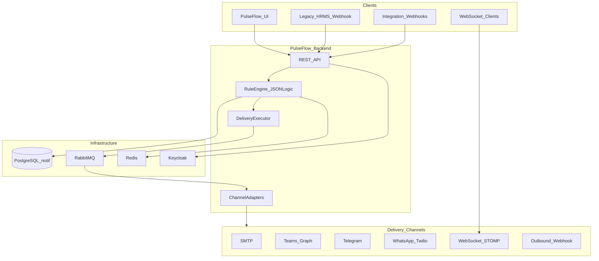
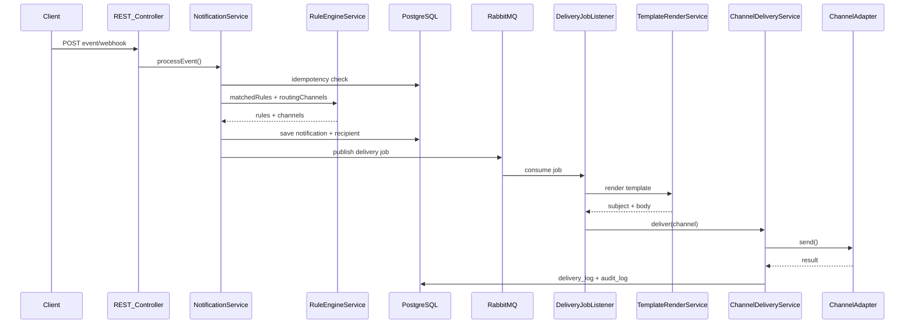
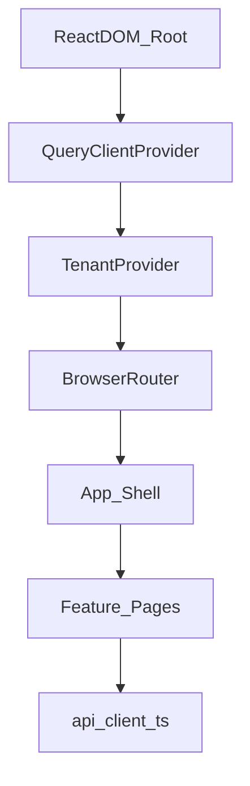
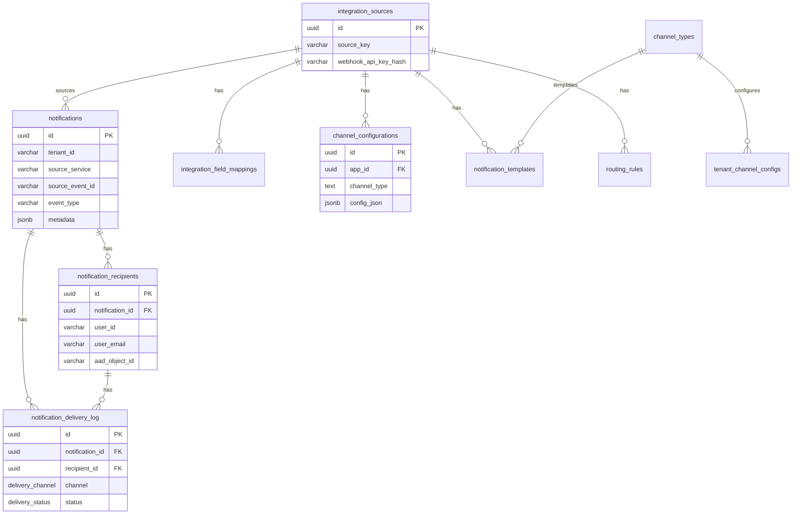
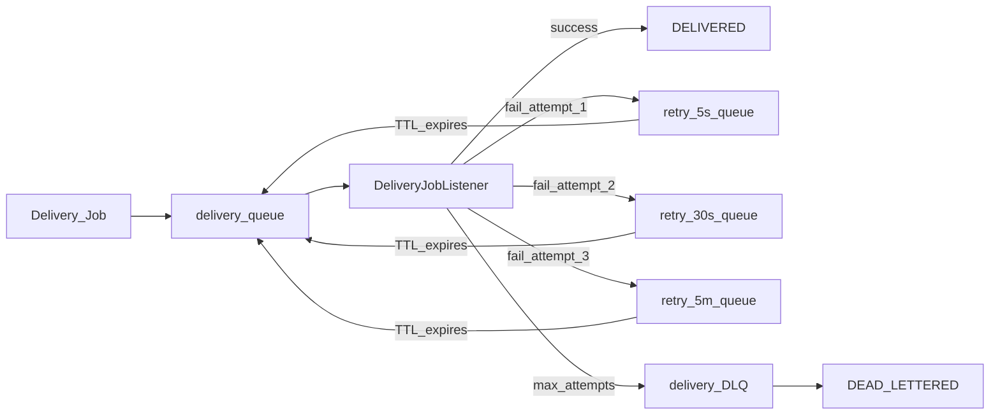

# PulseFlow – Event-Driven Communication Platform

**PulseFlow** is a production-ready, multi-tenant, event-driven notification platform for integrated business applications.

This document is the single source of truth for the entire PulseFlow monorepo. If you read it end to end, you will understand the architecture, data models, integrations, frontend and backend design, tooling, and how to run, test, and deploy the system.

---

## Table of Contents

1. [Introduction and Overview](#1-introduction-and-overview)
2. [Technology Stack](#2-technology-stack)
3. [Architecture Deep Dive](#3-architecture-deep-dive)
4. [Data Model Reference](#4-data-model-reference)
5. [Authentication and Authorization](#5-authentication-and-authorization)
6. [API Reference](#6-api-reference)
7. [Channel Delivery System](#7-channel-delivery-system)
8. [Rule Engine and Templating](#8-rule-engine-and-templating)
9. [Messaging Infrastructure (RabbitMQ)](#9-messaging-infrastructure-rabbitmq)
10. [Frontend Feature Guide](#10-frontend-feature-guide)
11. [Integrations Guide](#11-integrations-guide)
12. [Configuration and Environment Variables](#12-configuration-and-environment-variables)
13. [Getting Started](#13-getting-started)
14. [Testing](#14-testing)
15. [Deployment](#15-deployment)
16. [Production Hardening Checklist](#16-production-hardening-checklist)

---

## 1. Introduction and Overview

### What is PulseFlow?

PulseFlow is a **multi-tenant notification platform** that processes and delivers business events across multiple communication channels. When something happens in an integrated application (leave approved, order shipped, security alert), the right people receive the right message through the right channel — without each application building its own notification stack.

### Platform Highlights

| Area | Description |
|------|-------------|
| **Multi-tenant architecture** | Tenant-isolated notification lifecycle, audit logging, and delivery tracking |
| **Event-driven processing** | RabbitMQ for asynchronous message processing, retry mechanisms, and dead-letter queue handling |
| **Rule-based engine** | Dynamically evaluates event conditions and routes notifications to appropriate delivery channels |
| **Multi-channel delivery** | Email, Microsoft Teams, Telegram, WhatsApp, WebSocket, and outbound webhooks |
| **Template management** | Configurable templates with dynamic message rendering and localization |
| **Security** | Keycloak OAuth2/JWT with role-based access control |
| **Data layer** | PostgreSQL models optimized for notification lifecycle and multi-tenant isolation |
| **Operations** | Docker containerization and Redis caching for performance and scalability |

**Tech stack:** Java 21, Spring Boot, React.js, PostgreSQL, RabbitMQ, Redis, Keycloak, Docker.

### What PulseFlow Does

| Capability | Description |
|------------|-------------|
| **Event ingestion** | Accept events via REST API, HRMS webhooks, or generic integration webhooks |
| **Rule evaluation** | Match events to notification rules using role, event type, and JSON Logic conditions |
| **Channel routing** | Determine which delivery channels to use per event via routing rules |
| **Template rendering** | Render Mustache templates per event type, channel, and locale |
| **Async delivery** | Queue delivery jobs in RabbitMQ with retry backoff and dead-letter handling |
| **Multi-channel delivery** | Email, Teams, Telegram, WhatsApp, WebSocket, outbound webhooks |
| **Audit and observability** | Immutable audit log, delivery logs, failure tracking |
| **Admin UI** | React dashboard for inbox, rules, logs, channels, templates, and platform config |

### Monorepo Layout

```text
PulseFlow/
├── backend/                          # Java 21 / Spring Boot 3.3.4 API
│   ├── pom.xml
│   ├── Dockerfile
│   ├── docker-compose.yml            # Backend-scoped compose (optional)
│   └── src/
│       ├── main/java/com/pulseflow/
│       └── main/resources/
│           ├── application.yml
│           ├── db/migration/         # Flyway V1–V20
│           └── keycloak/pulseflow-realm.json
├── frontend/                         # React 19 / Vite / TypeScript SPA ("PulseFlow")
│   ├── package.json
│   ├── vite.config.ts
│   ├── Dockerfile
│   ├── nginx.conf
│   └── src/
│       ├── app/                      # Shell, routing, TenantContext
│       ├── api/client.ts             # All API functions
│       ├── features/                 # Feature-sliced pages
│       ├── shared/components/        # Reusable UI
│       └── style.css                 # Design system
├── docker-compose.yml                # Full stack: Postgres, Redis, RabbitMQ, Keycloak, backend
├── .env.example                      # Environment variable template
├── pulseflow-realm.json                   # Keycloak realm import (root copy for Docker)
└── postman_collection.json           # API testing collection
```

### High-Level System Diagram



---

## 2. Technology Stack

### Backend

Source: [backend/pom.xml](backend/pom.xml)

| Category | Technology | Version / Notes |
|----------|-----------|-----------------|
| Language | Java | 21 |
| Framework | Spring Boot | 3.3.4 |
| Build | Maven | 3.9+ |
| API | Spring Web REST | Jakarta Validation |
| ORM | Spring Data JPA + Hibernate | `ddl-auto: validate` |
| Database | PostgreSQL | 16, schema `notif` |
| Migrations | Flyway | V1–V20 scripts |
| Auth | Spring Security + OAuth2 Resource Server | Keycloak JWT |
| Messaging | Spring AMQP | RabbitMQ 3.13 |
| Cache | Spring Data Redis | Redis 7 |
| Real-time | Spring WebSocket + STOMP/SockJS | Endpoint `/ws` |
| Email | Spring Mail (custom SMTP service) | Auto-config excluded |
| Templating | Mustache (`compiler` 0.9.14) | Per-event/channel templates |
| Rule engine | `json-logic-java` | JSON Logic conditions |
| WhatsApp | Twilio SDK | 10.6.2 |
| Utilities | Lombok, MapStruct, Jackson | DTO mapping |
| Testing | JUnit 5, Spring Boot Test, Testcontainers | PostgreSQL + RabbitMQ |

### Frontend

Source: [frontend/package.json](frontend/package.json)

| Category | Technology | Version / Notes |
|----------|-----------|-----------------|
| Language | TypeScript | ~5.9.3 |
| Framework | React | ^19.2.4 |
| Build | Vite | ^6.3.5 (Node 20.10+; Vite 8 requires Node 20.19+) |
| Routing | react-router-dom | ^6.30.2 |
| Server state | TanStack React Query | ^5.95.0 |
| HTTP | Axios | ^1.13.6 |
| Styling | Custom CSS design tokens | [frontend/src/style.css](frontend/src/style.css) |
| Testing | Vitest + Testing Library | jsdom environment |

**Note:** `@mui/material`, `@emotion/*`, and `zustand` are listed in `package.json` but are not used in the current codebase.

### Infrastructure

Source: [docker-compose.yml](docker-compose.yml)

| Service | Image | Host Port | Purpose |
|---------|-------|-----------|---------|
| postgres | postgres:16 | `${POSTGRES_PORT}` (default 35432) | Primary data store |
| redis | redis:7 | internal only | Rules/template cache |
| rabbitmq | rabbitmq:3.13-management | 5672, 15672 | Async messaging + management UI |
| keycloak | keycloak:26.0 | 8080 | Identity provider (JWT) |
| backend | built from `./backend` | `${SERVER_PORT}` (default 8081) | Spring Boot API |

### Developer Tools

| Tool | Location | Purpose |
|------|----------|---------|
| Postman collection | [postman_collection.json](postman_collection.json) | API testing |
| Environment template | [.env.example](.env.example) | All configurable variables |
| Keycloak realm | [backend/src/main/resources/keycloak/pulseflow-realm.json](backend/src/main/resources/keycloak/pulseflow-realm.json) | Pre-seeded users, roles, clients |

---

## 3. Architecture Deep Dive

### 3.1 Backend Layered Architecture

The backend follows a classic **Spring Boot layered architecture** with a **hexagonal channel adapter** pattern for delivery.

```text
backend/src/main/java/com/pulseflow/
├── PulseFlowApplication.java   # Entry point (@EnableCaching, @EnableScheduling)
├── controller/                     # 6 REST controllers
├── service/                        # Business logic interfaces
├── service/impl/                   # Service implementations
├── repository/                     # 14 Spring Data JPA repositories
├── domain/
│   ├── entity/                     # 14 JPA entities
│   ├── enums/                      # PostgreSQL enum mappings
│   └── port/                       # ChannelSender port interface
├── adapter/channel/                # 11 channel senders + registry + config resolver
├── integration/                    # SMTP, Teams Graph, Telegram services
├── messaging/                      # RabbitMQ publishers and listeners
├── config/                         # Security, RabbitMQ, Redis, WebSocket, CORS
├── dto/                            # Request/response records
├── exception/                      # GlobalExceptionHandler
└── util/                           # ApiKeyHasher
```

| Layer | Responsibility |
|-------|----------------|
| **Controller** | HTTP routing, validation, auth enforcement |
| **Service** | Business logic, orchestration, idempotency |
| **Repository** | Database access via JPA |
| **Domain** | Entities, enums, port interfaces |
| **Adapter** | Channel-specific delivery implementations |
| **Integration** | External API clients (Graph, Telegram, SMTP) |
| **Messaging** | Async event audit and delivery job processing |

### 3.2 Design Patterns

| Pattern | Implementation | Why |
|---------|----------------|-----|
| **Multi-tenancy** | `tenant_id` on all core tables; required in API query params | Isolates data per organization |
| **Idempotency** | Unique constraint `(tenant_id, source_service, source_event_id)` on `notifications` | Prevents duplicate notifications from retried webhooks |
| **Hexagonal adapters** | `ChannelSender` port + `ChannelSenderRegistry` | Add new channels without changing core delivery logic |
| **Async delivery** | RabbitMQ with TTL retry queues (5s / 30s / 5m) and DLQ | Decouples ingestion from delivery; handles transient failures |
| **Dual auth** | JWT for user/admin APIs; `X-Webhook-Api-Key` for inbound webhooks | Different trust models for humans vs. machine integrations |
| **Caching** | Redis `rulesCache` and `templateCache` (5-min TTL) | Reduces DB load for hot-path rule/template lookups |
| **Scheduled archival** | `NotificationArchiveScheduler` daily at 02:00, 90-day retention | Keeps active tables performant |
| **Immutable audit** | `notification_audit_log` with DB-level protections | Compliance and debugging |

### 3.3 End-to-End Event Flow

When an event arrives (via REST, webhook, or integration notify), the following pipeline executes:

```text
1. Event ingestion
   REST POST /api/v1/notifications/events
   OR webhook POST /api/v1/hrms/webhook
   OR integration POST /api/v1/integrations/{sourceKey}/webhook|notify

2. NotificationService.processEvent()
   - Idempotency check on (tenant_id, source_service, source_event_id)
   - Field mapping applied (for integration sources)

3. RuleEngineService
   - Match notification_rules by tenant, role, event_type, JSON Logic conditions
   - Resolve delivery channels via routing_rules (or rule-level channel array)

4. Persistence
   - Insert notification row
   - Insert notification_recipient row(s)
   - Publish audit event to RabbitMQ

5. NotificationDeliveryExecutor
   - Publish delivery job to RabbitMQ delivery queue

6. DeliveryJobListener (async consumer)
   - TemplateRenderService: resolve Mustache template for event/channel/locale
   - ChannelDeliveryService: invoke ChannelSenderRegistry → adapter
   - Write notification_delivery_log entry
   - On failure: retry via TTL queues or dead-letter
```



**Key classes:**

| Class | File | Role |
|-------|------|------|
| `NotificationServiceImpl` | `service/impl/NotificationServiceImpl.java` | Event ingestion, idempotency, orchestration |
| `RuleEngineServiceImpl` | `service/impl/RuleEngineServiceImpl.java` | Rule matching, channel resolution |
| `NotificationDeliveryExecutor` | `service/impl/NotificationDeliveryExecutor.java` | Publishes delivery jobs to RabbitMQ |
| `DeliveryJobListener` | `messaging/DeliveryJobListener.java` | Consumes jobs, triggers delivery |
| `ChannelDeliveryService` | `service/impl/ChannelDeliveryService.java` | Orchestrates adapter calls + logging |
| `TemplateRenderService` | `service/impl/TemplateRenderService.java` | Mustache rendering |

### 3.4 Frontend Architecture

The frontend is a **feature-sliced React SPA** branded **PulseFlow**.

#### Bootstrap and Provider Tree

Source: [frontend/src/main.tsx](frontend/src/main.tsx)

```text
ReactDOM.createRoot
  └── QueryClientProvider          # TanStack Query (server state)
        └── TenantProvider          # tenantId + userId (React Context + localStorage)
              └── BrowserRouter     # React Router v6
                    └── App         # Shell layout + routes
```



#### State Management

| Layer | Mechanism | Purpose |
|-------|-----------|---------|
| Server/async data | TanStack Query (`useQuery`, `useMutation`) | API reads/writes, cache invalidation |
| Tenant/user identity | `TenantContext` + `localStorage` | `tenantId`, `userId` persisted across sessions |
| Local UI state | React `useState` | Filters, tabs, forms, theme toggle |
| Global store | None active | `zustand` installed but unused |

**Tenant context keys:** `pulseflow.tenantId` (default `"default"`), `pulseflow.userId` (default `"demo-user"`).

#### Route-to-Feature Mapping

| Route | Component | Module |
|-------|-----------|--------|
| `/` | `DashboardPage` | `features/dashboard/` |
| `/rules` | `RulesPage` | `features/rules/` |
| `/delivery` | `DeliveryLogsPage` | `features/delivery/` |
| `/audit` | `AuditLogsPage` | `features/audit/` |
| `/channels` | `ChannelsPage` | `features/channels/` |
| `/templates` | `TemplatesPage` | `features/templates/` |
| `/applications` | `ApplicationsPage` | `features/applications/` |
| `/settings` | `SettingsPage` | `features/settings/` |
| `/configuration` | `ConfigurationPage` | `features/configuration/` |
| `*` | Redirect to `/` | — |

#### Shared Components

Located in [frontend/src/shared/components/](frontend/src/shared/components/):

- `Badge` — status and channel labels
- `StatCard` — dashboard metric cards
- `DataTable` — paginated tables with expandable rows
- `Skeleton` — loading placeholders
- `ErrorState` — error display with retry

#### API Layer

All HTTP calls are centralized in [frontend/src/api/client.ts](frontend/src/api/client.ts). The Axios instance:

- Dev: `baseURL = /api/v1` (Vite proxies to `localhost:8081`)
- Prod: `VITE_API_URL` or `/api/v1`
- Attaches `Authorization: Bearer <token>` from Keycloak OIDC (PKCE) via request interceptor; optional `VITE_JWT_TOKEN` override for tests

---

## 4. Data Model Reference

### 4.1 PostgreSQL Schema (`notif`)

All application tables live in the `notif` schema. Flyway owns the schema; Hibernate runs with `ddl-auto: validate`.

#### Enum Types

Source: [V1__init_extensions_schemas_types.sql](backend/src/main/resources/db/migration/V1__init_extensions_schemas_types.sql) (extended in later migrations)

| Enum | Values |
|------|--------|
| `notification_type` | `SYSTEM`, `HR_ACTION`, `REMINDER`, `ANNOUNCEMENT`, `SECURITY`, `WORKFLOW` |
| `priority_level` | `LOW`, `MEDIUM`, `HIGH`, `CRITICAL` |
| `notification_status` | `ACTIVE`, `EXPIRED`, `ARCHIVED`, `SOFT_DELETED`, `DELIVERED`, `DEAD_LETTERED` (V15, V17) |
| `delivery_channel` | `WEBSOCKET`, `SSE`, `EMAIL`, `PUSH`, `POLLING`, `TEAMS`, `WHATSAPP`, `TELEGRAM` (V9), `WEBHOOK` (V11) |
| `delivery_status` | `PENDING`, `DELIVERED`, `FAILED`, `RETRYING`, `DEAD_LETTERED`, `SKIPPED` (V19) |

### 4.2 Core Tables

#### `notifications`

The central notification record.

| Column | Type | Description |
|--------|------|-------------|
| `id` | UUID | Primary key |
| `tenant_id` | VARCHAR(64) | Tenant isolation |
| `title` | VARCHAR(255) | Notification title |
| `body` | TEXT | Notification body |
| `type` | notification_type | Category |
| `priority` | priority_level | Urgency |
| `status` | notification_status | Lifecycle state |
| `source_service` | VARCHAR(100) | Originating service name |
| `source_event_id` | VARCHAR(255) | Idempotency key component |
| `event_type` | VARCHAR(255) | Normalized event type (V11) |
| `integration_source_id` | UUID | FK to integration_sources (V11) |
| `correlation_id` | VARCHAR(255) | Tracing ID (V11) |
| `metadata` | JSONB | Arbitrary event metadata |
| `created_at` / `updated_at` | TIMESTAMPTZ | Timestamps |
| `expires_at` | TIMESTAMPTZ | Optional expiry |
| `is_deleted` | BOOLEAN | Soft delete flag |
| `version` | BIGINT | Optimistic locking |

**Unique constraint:** `(tenant_id, source_service, source_event_id)` — idempotency.

#### `notification_recipients`

Per-user inbox entries.

| Column | Type | Description |
|--------|------|-------------|
| `id` | UUID | Primary key |
| `tenant_id` | VARCHAR(64) | Tenant |
| `notification_id` | UUID | FK → notifications |
| `user_id` | VARCHAR(255) | Target user |
| `role_name` | VARCHAR(100) | Role at time of delivery |
| `user_email` | VARCHAR(255) | Email for EMAIL channel (V7) |
| `aad_object_id` | VARCHAR(255) | Azure AD ID for Teams (V7) |
| `telegram_chat_id` | VARCHAR(255) | Telegram chat ID (V9) |
| `is_read` / `is_acknowledged` | BOOLEAN | Inbox state |
| `read_at` / `acknowledged_at` | TIMESTAMPTZ | State timestamps |

**Unique constraint:** `(tenant_id, notification_id, user_id)`.

#### `notification_rules`

Role/event-based rules with JSON Logic conditions.

| Column | Type | Description |
|--------|------|-------------|
| `id` | UUID | Primary key |
| `tenant_id` | VARCHAR(64) | Tenant |
| `name` | VARCHAR(255) | Rule name |
| `role_name` | VARCHAR(100) | Target role |
| `event_type` | VARCHAR(255) | Optional event filter (V11) |
| `integration_source_id` | UUID | Optional source filter (V11) |
| `notification_type` | notification_type | Optional type filter |
| `priority_override` | priority_level | Override default priority |
| `conditions` | JSONB | Legacy key-value conditions |
| `conditions_jsonlogic` | JSONB | JSON Logic conditions (V11) |
| `channels` | delivery_channel[] | Default channels for this rule |
| `eval_order` | SMALLINT | Evaluation order (ascending) |
| `is_active` | BOOLEAN | Enable/disable |

#### `routing_rules`

Channel routing with JSON Logic (separate from notification rules).

| Column | Type | Description |
|--------|------|-------------|
| `id` | UUID | Primary key |
| `tenant_id` | VARCHAR(64) | Tenant |
| `name` | VARCHAR(255) | Rule name |
| `event_type` | VARCHAR(255) | Optional event filter |
| `role_name` | VARCHAR(100) | Optional role filter |
| `integration_source_id` | UUID | Optional source filter |
| `conditions_jsonlogic` | JSONB | JSON Logic conditions |
| `channel_type_codes` | TEXT[] | Channels to route to (e.g. `EMAIL`, `TEAMS`) |
| `eval_order` | SMALLINT | Evaluation order |
| `is_active` | BOOLEAN | Enable/disable |

#### `notification_delivery_log`

Per-channel delivery attempt records.

| Column | Type | Description |
|--------|------|-------------|
| `id` | UUID | Primary key |
| `tenant_id` | VARCHAR(64) | Tenant |
| `notification_id` | UUID | FK → notifications |
| `recipient_id` | UUID | FK → notification_recipients |
| `channel` | delivery_channel | Delivery channel |
| `status` | delivery_status | PENDING, DELIVERED, FAILED, etc. |
| `attempt_count` | SMALLINT | Current attempt number |
| `max_attempts` | SMALLINT | Max retries (default 3–4) |
| `error_message` | TEXT | Last error |
| `template_id` | UUID | Template used (V20) |
| `created_at` / `delivered_at` | TIMESTAMPTZ | Timestamps |

#### `notification_failures`

Unresolved failure tracking for investigation.

| Column | Type | Description |
|--------|------|-------------|
| `id` | UUID | Primary key |
| `tenant_id` | VARCHAR(64) | Tenant |
| `notification_id` | UUID | Optional FK |
| `recipient_id` | UUID | Optional FK |
| `channel` | delivery_channel | Channel that failed |
| `failure_reason` | TEXT | Error description |
| `raw_event_payload` | JSONB | Original event data |
| `is_resolved` | BOOLEAN | Resolution flag |
| `occurred_at` | TIMESTAMPTZ | When failure occurred |

#### `notification_audit_log`

Immutable audit trail.

| Column | Type | Description |
|--------|------|-------------|
| `id` | BIGSERIAL | Primary key |
| `tenant_id` | VARCHAR(64) | Tenant |
| `notification_id` | UUID | Related notification |
| `recipient_id` | UUID | Related recipient |
| `action` | VARCHAR(64) | Action type (CREATED, DELIVERED, READ, etc.) |
| `actor_user_id` | VARCHAR(255) | Who performed the action |
| `metadata` | JSONB | Additional context |
| `correlation_id` | VARCHAR(255) | Tracing ID |
| `occurred_at` | TIMESTAMPTZ | Timestamp |

#### `notifications_archive`

Cold storage for archived notifications (populated by scheduler).

#### Platform Configuration Tables

| Table | Purpose |
|-------|---------|
| `integration_sources` | External system registrations (`source_key`, webhook API key hash) |
| `integration_field_mappings` | Payload field mapping JSON per integration source |
| `channel_types` | Channel catalog (EMAIL, TEAMS, TELEGRAM, etc.) |
| `tenant_channel_configs` | Per-tenant channel credentials (JSONB config) |
| `channel_configurations` | Per-app channel JSON config (teams, smtp, telegram, whatsapp, webhook) |
| `tenant_integration_config` | Tenant-level integration settings (teams, smtp, webhook_security, hrms_mapping, templates JSONB) |
| `notification_templates` | Mustache templates per event_type / channel / locale |

### 4.3 Entity-Relationship Diagram



### 4.4 JPA Entity Mapping

All entities in [backend/src/main/java/com/pulseflow/domain/entity/](backend/src/main/java/com/pulseflow/domain/entity/):

| Entity Class | Table | Notable Mappings |
|--------------|-------|------------------|
| `Notification` | `notifications` | JSONB `metadata`; enum `type`, `priority`, `status` |
| `NotificationRecipient` | `notification_recipients` | FK to Notification |
| `NotificationRule` | `notification_rules` | JSONB `conditions`, `conditionsJsonlogic`; enum array `channels` |
| `RoutingRule` | `routing_rules` | JSONB `conditionsJsonlogic`; String array `channelTypeCodes` |
| `NotificationDeliveryLog` | `notification_delivery_log` | Enum `channel`, `status` |
| `NotificationFailure` | `notification_failures` | JSONB `rawEventPayload` |
| `NotificationAuditLog` | `notification_audit_log` | JSONB `metadata` |
| `NotificationTemplateEntity` | `notification_templates` | FK to IntegrationSource (optional) |
| `IntegrationSource` | `integration_sources` | JSONB `metadata` |
| `IntegrationFieldMapping` | `integration_field_mappings` | JSONB `mapping` |
| `ChannelTypeEntity` | `channel_types` | JSONB `capabilities` |
| `TenantChannelConfig` | `tenant_channel_configs` | JSONB `config` |
| `ChannelConfiguration` | `channel_configurations` | JSONB `configJson` |
| `TenantIntegrationConfig` | `tenant_integration_config` | JSONB columns for teams, smtp, etc. |

JSONB columns use `@JdbcTypeCode(SqlTypes.JSON)`. PostgreSQL enums use `@JdbcTypeCode(SqlTypes.NAMED_ENUM)`.

### 4.5 Flyway Migration History

All migrations in [backend/src/main/resources/db/migration/](backend/src/main/resources/db/migration/):

| Version | File | Purpose |
|---------|------|---------|
| V1 | `init_extensions_schemas_types` | `pgcrypto` extension, `notif` schema, enum types |
| V2 | `core_tables_indexes` | Core tables: notifications, recipients, rules, delivery_log, failures |
| V3 | `audit_archive_objects` | Audit log + archive table |
| V4 | `functions_views_policies` | DB functions, views, immutability policies |
| V5 | `seed_rules_sample_data` | Sample rules and notification data |
| V6 | `db_hardening_safety_constraints` | Additional safety constraints |
| V7 | `add_user_contact_fields` | `user_email`, `aad_object_id` on recipients |
| V8 | `add_tenant_integration_config` | `tenant_integration_config` table |
| V9 | `add_telegram_channel_and_recipient_chat` | TELEGRAM enum + `telegram_chat_id` |
| V10 | `add_telegram_config_column` | Telegram config in tenant integration |
| V11 | `platform_config_tables` | Integration sources, field mappings, channel types, tenant channel configs, templates, routing rules |
| V12 | `backfill_integration_sources` | Data backfill for integration sources |
| V13 | `backfill_routing_rules_from_notification_rules` | Migrate rules to routing rules |
| V14 | `add_channel_configurations_table` | Per-app channel JSON configurations |
| V15 | `add_dead_lettered_notification_status` | `DEAD_LETTERED` notification status |
| V16 | `allow_websocket_channel_configuration` | WebSocket in channel_configurations |
| V17 | `add_delivered_notification_status` | `DELIVERED` notification status |
| V18 | `fix_idempotency_null_constraint` | Fix null handling in idempotency constraint |
| V19 | `add_skipped_delivery_status` | `SKIPPED` delivery status |
| V20 | `add_template_id_to_delivery_log` | `template_id` FK on delivery log |

---

## 5. Authentication and Authorization

PulseFlow uses a **dual authentication model**: JWT for human/admin API access, and API keys for machine-to-machine webhook ingestion.

### 5.1 JWT Flow (Keycloak)

**Configuration:** [backend/src/main/java/com/pulseflow/config/SecurityConfig.java](backend/src/main/java/com/pulseflow/config/SecurityConfig.java)

| Setting | Value |
|---------|-------|
| Realm | `pulseflow` |
| Issuer URI | `KEYCLOAK_ISSUER_URI` (default `http://localhost:8080/realms/pulseflow`) |
| JWKS override (Docker) | `APP_KEYCLOAK_JWKS_URI` → internal Keycloak certs URL |
| Bootstrap | `KeycloakRealmBootstrap` imports realm on startup |

**Pre-seeded users** (from [pulseflow-realm.json](backend/src/main/resources/keycloak/pulseflow-realm.json)):

| Username | Password | Role |
|----------|----------|------|
| `pulseflow-admin` | `admin123` | `ADMIN` |
| `pulseflow-employee` | `employee123` | `EMPLOYEE` |

**Clients:**

| Client ID | Type | Use Case |
|-----------|------|----------|
| `pulseflow-frontend` | Public (PKCE) | Browser SPA (redirect `http://localhost:5173/*`) |
| `pulseflow-postman` | Confidential | API testing (direct access grants, secret: `pulseflow-postman-secret`) |

**Authorization rules:**

| Path Pattern | Requirement |
|--------------|-------------|
| `OPTIONS /**` | Permitted (CORS preflight) |
| `/api/v1/hrms/webhook`, `/api/v1/integrations/*/webhook`, `/api/v1/integrations/*/notify` | Permitted (API key filter handles auth) |
| `/api/v1/admin/**` | `ROLE_ADMIN` |
| All other `/api/v1/**` | Authenticated JWT |

Roles are extracted from JWT `roles` claim or `realm_access.roles`, mapped to Spring `ROLE_*` authorities.

### 5.2 Webhook API Key Auth

Inbound webhooks do not use JWT. Instead, `WebhookApiKeyFilter` validates:

| Header | Purpose |
|--------|---------|
| `X-Webhook-Api-Key` | API key (plain text; hashed and compared server-side) |
| `X-Tenant-Id` | Tenant scope (falls back to `HRMS_DEFAULT_TENANT_ID`) |

**Key resolution order:**

1. Per-source SHA-256 hash in `integration_sources.webhook_api_key_hash`
2. Global fallback: `HRMS_WEBHOOK_API_KEY` (default `changeme`)

Successful validation grants `ROLE_HRMS` principal.

### 5.3 Frontend Auth (Current Dev Model)

The frontend has **no interactive login UI**. Authentication works as follows:

1. Obtain a JWT from Keycloak (see [Getting Started](#13-getting-started))
2. Set `VITE_JWT_TOKEN` in `frontend/.env.local`
3. Axios interceptor attaches `Authorization: Bearer <token>` on every request

**Tenant/user scoping** (separate from auth):

- `TenantContext` stores `tenantId` and `userId` in `localStorage`
- Editable from topbar inputs and Settings page
- Passed as query params to API calls

**Production gaps (not yet implemented):**

- No Keycloak redirect/OAuth flow in the SPA
- No token refresh
- No role-based route guards in the UI
- No protected routes

---

## 6. API Reference

All endpoints are prefixed with `/api/v1`. Unless noted, JWT authentication is required.

### 6.1 User APIs

Controller: [NotificationController](backend/src/main/java/com/pulseflow/controller/NotificationController.java)

| Method | Path | Auth | Description |
|--------|------|------|-------------|
| `POST` | `/notifications/events` | JWT | Ingest a notification event |
| `GET` | `/notifications` | JWT | List notifications (inbox) |
| `POST` | `/notifications/{notificationId}/read` | JWT | Mark notification as read |

**Query params for GET /notifications:** `tenantId` (required), `userId` (optional, for inbox filtering), `status`, `priority`, pagination.

### 6.2 Admin APIs

Controller: [AdminController](backend/src/main/java/com/pulseflow/controller/AdminController.java) — requires `ROLE_ADMIN`.

| Method | Path | Description |
|--------|------|-------------|
| `GET` | `/admin/health` | Health check |
| `GET/POST/PUT/DELETE` | `/admin/rules` | Notification rules CRUD |
| `GET` | `/admin/delivery` | Paginated delivery logs |
| `GET` | `/admin/delivery/{notificationId}` | Delivery logs for one notification |
| `GET` | `/admin/audit` | Paginated audit logs |
| `GET/PUT` | `/admin/config/integrations` | Tenant integration config |
| `GET/PUT` | `/admin/config/webhook-security` | Webhook security settings |
| `GET/PUT` | `/admin/config/hrms-mapping` | HRMS field mapping config |
| `GET/PUT` | `/admin/templates` | Template defaults config |
| `GET/POST/PUT` | `/admin/integrations/sources` | Integration source management |
| `GET/POST` | `/admin/integrations/field-mappings` | Field mapping management |
| `GET/POST/PUT` | `/admin/channel-configs` | Tenant channel config CRUD |
| `GET/POST/PUT/DELETE` | `/admin/routing-rules` | Routing rules CRUD |
| `GET/POST/PUT/DELETE` | `/admin/db-templates` | DB-backed template CRUD |

### 6.3 Channel Configuration APIs

Controller: [ChannelConfigurationAdminController](backend/src/main/java/com/pulseflow/controller/ChannelConfigurationAdminController.java)

| Method | Path | Description |
|--------|------|-------------|
| `GET` | `/admin/channel-configurations` | List per-app channel configs |
| `POST` | `/admin/channel-configurations` | Create channel config |
| `PUT` | `/admin/channel-configurations/{id}` | Update channel config |
| `DELETE` | `/admin/channel-configurations/{id}` | Delete channel config |
| `POST` | `/admin/channel-configurations/{id}/test` | Test channel connectivity |

### 6.4 Webhook APIs (API Key Auth)

| Method | Path | Controller | Description |
|--------|------|------------|-------------|
| `POST` | `/hrms/webhook` | `HrmsWebhookController` | HRMS event webhook |
| `POST` | `/integrations/{sourceKey}/webhook` | `IntegrationWebhookController` | Generic integration webhook |
| `POST` | `/integrations/{sourceKey}/notify` | `IntegrationNotifyController` | Direct notify with explicit recipients |

**Required headers:** `X-Webhook-Api-Key`, `X-Tenant-Id` (optional).

### 6.5 API Examples (cURL)

#### Obtain JWT Token (Keycloak direct grant)

```bash
curl -X POST "http://localhost:8080/realms/pulseflow/protocol/openid-connect/token" \
  -H "Content-Type: application/x-www-form-urlencoded" \
  -d "grant_type=password" \
  -d "client_id=pulseflow-postman" \
  -d "client_secret=pulseflow-postman-secret" \
  -d "username=pulseflow-admin" \
  -d "password=admin123"
```

Copy `access_token` from the response.

#### Create Notification Event

```bash
curl -X POST "http://localhost:8081/api/v1/notifications/events" \
  -H "Content-Type: application/json" \
  -H "Authorization: Bearer <jwt>" \
  -d '{
    "tenantId": "default",
    "eventType": "order_created",
    "sourceService": "orders",
    "sourceEventId": "evt-100",
    "userId": "u123",
    "roleName": "EMPLOYEE",
    "payload": {
      "event_type": "order_created",
      "amount": 1500,
      "user_id": "u123"
    }
  }'
```

#### Get Dashboard Notifications

```bash
curl "http://localhost:8081/api/v1/notifications?tenantId=default&userId=u123" \
  -H "Authorization: Bearer <jwt>"
```

#### Create Admin Rule

```bash
curl -X POST "http://localhost:8081/api/v1/admin/rules?tenantId=default" \
  -H "Content-Type: application/json" \
  -H "Authorization: Bearer <admin-jwt>" \
  -d '{
    "name": "High Value Orders",
    "roleName": "EMPLOYEE",
    "eventType": "ORDER_CREATED",
    "notificationType": "WORKFLOW",
    "conditions": {"min_amount": 1000},
    "channels": ["WEBSOCKET", "EMAIL"],
    "evalOrder": 10,
    "isActive": true
  }'
```

#### HRMS Webhook Ingestion

```bash
curl -X POST "http://localhost:8081/api/v1/hrms/webhook" \
  -H "Content-Type: application/json" \
  -H "X-Webhook-Api-Key: changeme" \
  -H "X-Tenant-Id: default" \
  -d '{
    "eventType": "LEAVE_APPROVED",
    "sourceEventId": "evt-hrms-001",
    "userId": "u123",
    "userEmail": "u123@example.com",
    "aadObjectId": "aad-object-id-abc",
    "roleName": "EMPLOYEE",
    "payload": {
      "leaveId": "L-456",
      "leaveType": "annual",
      "days": 3
    }
  }'
```

#### Integration Webhook

```bash
curl -X POST "http://localhost:8081/api/v1/integrations/my-app/webhook" \
  -H "Content-Type: application/json" \
  -H "X-Webhook-Api-Key: <source-api-key>" \
  -H "X-Tenant-Id: default" \
  -d '{
    "eventType": "PAYMENT_RECEIVED",
    "sourceEventId": "evt-int-001",
    "userId": "u123",
    "roleName": "EMPLOYEE",
    "payload": {
      "amount": 500
    }
  }'
```

#### Test Channel Configuration

```bash
curl -X POST "http://localhost:8081/api/v1/admin/channel-configurations/<id>/test?tenantId=default" \
  -H "Authorization: Bearer <admin-jwt>"
```

#### Mark Notification Read

```bash
curl -X POST "http://localhost:8081/api/v1/notifications/<notification-id>/read?tenantId=default&userId=u123" \
  -H "Authorization: Bearer <jwt>"
```

### Non-supported / limited inputs (current version)

- **SMTP**: attachments and open/click tracking pixels are **not supported**.
- **Stub channels**: `SSE`, `PUSH`, and `POLLING` exist in the enum/adapters but are **not selectable** in admin rules and are not demo-ready.
- **Ordering**: optional `sequenceNumber` / `eventTimestamp` are supported; when `sequenceNumber` is provided, older out-of-order events are dropped (latest wins).
- **WhatsApp**: missing Twilio credentials / destination phone are treated as non-retryable `SKIPPED` (no DLQ churn).
- **Outbound webhook**: optional `authType` (`API_KEY` / `BASIC` / `BEARER`) + explicit connect/read timeouts are supported via channel `configJson`.

See also ops metrics/alerts: [docs/MONITORING.md](docs/MONITORING.md).

---

## 7. Channel Delivery System

### 7.1 Channel Adapters

All adapters implement the `ChannelSender` port and are registered in `ChannelSenderRegistry`.

Source: [backend/src/main/java/com/pulseflow/adapter/channel/](backend/src/main/java/com/pulseflow/adapter/channel/)

| Channel | Adapter Class | Status | Integration Service |
|---------|----------------|--------|---------------------|
| EMAIL | `EmailChannelSender` | Implemented | `SmtpDeliveryService` |
| TEAMS | `TeamsChannelSender` | Implemented | Incoming Teams Webhook (Adaptive Cards) |
| TELEGRAM | `TelegramChannelSender` | Implemented | `TelegramBotService` |
| WHATSAPP | `WhatsappChannelSender` | Implemented | Twilio SDK |
| WEBSOCKET | `WebSocketChannelSender` | Implemented | STOMP broker (`/ws`, topic `/topic/tenant/{tenantId}`) |
| WEBHOOK | `WebhookChannelSender` | Implemented | Outbound HTTP POST |
| SSE | `SseChannelSender` | Stub | Not implemented |
| PUSH | `PushChannelSender` | Stub | Not implemented |
| POLLING | `PollingChannelSender` | Stub | Not implemented |

### 7.2 Channel Resolution

`TenantChannelConfigResolver` resolves per-tenant or per-app channel credentials from:

1. `channel_configurations` (per-app JSON config) — highest priority for app-specific delivery
2. `tenant_channel_configs` (per-tenant channel credentials)
3. Global environment variables (fallback for SMTP, Twilio, Graph, Telegram)

### 7.3 Delivery Retry Configuration

From [application.yml](backend/src/main/resources/application.yml):

| Setting | Default | Description |
|---------|---------|-------------|
| `app.delivery.max-attempts` | 4 | Maximum delivery attempts per channel |
| `app.delivery.default-channel` | WEBSOCKET | Fallback when no routing rule matches |
| `app.delivery.retry.delay-1-seconds` | 5 | First retry delay |
| `app.delivery.retry.delay-2-seconds` | 30 | Second retry delay |
| `app.delivery.retry.delay-3-seconds` | 300 | Third retry delay (5 minutes) |

After max attempts, the delivery is moved to the dead-letter queue and status set to `DEAD_LETTERED`.

### 7.4 WebSocket Real-Time Delivery

| Setting | Value |
|---------|-------|
| Endpoint | `/ws` (SockJS fallback supported) |
| Topic pattern | `/topic/tenant/{tenantId}` |
| Protocol | STOMP over WebSocket |

**Note:** The React SPA subscribes to `/topic/tenant/{tenantId}` via SockJS/STOMP after Keycloak login.

---

## 8. Rule Engine and Templating

### 8.1 Notification Rules

Source: [RuleEngineServiceImpl](backend/src/main/java/com/pulseflow/service/impl/RuleEngineServiceImpl.java)

Rules are evaluated in **`eval_order` ascending** (lowest first). **All matching rules** are returned (not first-match-only).

**Filter chain for `notification_rules`:**

1. `tenant_id` matches
2. `is_active = true`
3. `role_name` matches (case-insensitive)
4. `notification_type` is null or matches event type
5. `event_type` is null/blank or matches (case-insensitive)
6. `integration_source_id` is null or matches
7. Conditions pass (JSON Logic or legacy key-value)

**Legacy conditions** (backward compatible):

```json
{"min_amount": 1000, "event_type": "order_created"}
```

- `min_amount`: numeric comparison against `payload.amount`
- Other keys: exact equality match against payload fields

### 8.2 Routing Rules

Routing rules determine **which channels** to deliver through. Evaluated in `eval_order` ascending; **all matching rules contribute channels** (union via `LinkedHashSet`).

**Filter chain:**

1. `tenant_id` + `is_active`
2. `role_name` null/blank or matches
3. `event_type` null/blank or matches
4. `integration_source_id` null or matches
5. JSON Logic `conditions_jsonlogic` passes
6. Collect `channel_type_codes` from all matches

Results are cached in Redis (`rulesCache`, key: `rules:{tenantId}:{eventType}`).

### 8.3 JSON Logic Example

```json
{
  ">": [
    {"var": "amount"},
    1000
  ]
}
```

This matches when `payload.amount > 1000`.

### 8.4 Mustache Templating

`TemplateRenderService` resolves templates from `notification_templates` table:

| Lookup Key | Fields |
|------------|--------|
| Tenant + event_type + channel + locale | Global template |
| Tenant + integration_source + event_type + channel + locale | Source-specific template |

**Example template:**

```
Subject: Leave Approved for {{employee_name}}
Body: Your leave request {{leave_id}} from {{start_date}} to {{end_date}} has been approved.
```

Variables are populated from the event payload (after field mapping) and standard fields (`title`, `body`, `userId`, etc.).

Templates are cached in Redis (`templateCache`).

---

## 9. Messaging Infrastructure (RabbitMQ)

### 9.1 Topology

Source: [application.yml](backend/src/main/resources/application.yml)

#### Event Audit Pipeline

| Component | Name | Purpose |
|-----------|------|---------|
| Exchange | `pulseflow.events` | Event audit fanout |
| Queue | `pulseflow.events.queue` | Audit event consumer |
| DLQ | `pulseflow.events.dlq` | Failed audit events |
| Routing key | `pulseflow.event.created` | Event routing |

**Publisher:** `NotificationEventPublisher`
**Listener:** `NotificationEventListener`

#### Delivery Pipeline

| Component | Name | Purpose |
|-----------|------|---------|
| Exchange | (delivery exchange) | Delivery job routing |
| Queue | `pulseflow.delivery.queue` | Primary delivery consumer |
| DLQ | `pulseflow.delivery.dlq` | Permanently failed deliveries |
| Routing key | `pulseflow.delivery.job` | Delivery job routing |

**Publisher:** `DeliveryJobPublisher`
**Listener:** `DeliveryJobListener`

#### Retry Queues (TTL-based)

| Queue | TTL | Routing Key |
|-------|-----|-------------|
| `pulseflow.delivery.retry.5s.queue` | 5 seconds | `pulseflow.delivery.retry.5s` |
| `pulseflow.delivery.retry.30s.queue` | 30 seconds | `pulseflow.delivery.retry.30s` |
| `pulseflow.delivery.retry.5m.queue` | 5 minutes | `pulseflow.delivery.retry.5m` |

### 9.2 Retry Escalation Flow



### 9.3 Async Mode

`app.messaging.delivery-async` (default `false`) controls whether delivery jobs are processed synchronously or via RabbitMQ. In production, set to `true` for decoupled delivery.

---

## 10. Frontend Feature Guide

The frontend SPA is branded **PulseFlow**. Each route maps to a feature module and specific backend APIs.

### 10.1 Dashboard (`/`)

**Module:** [features/dashboard/DashboardPage.tsx](frontend/src/features/dashboard/DashboardPage.tsx)

| Feature | API |
|---------|-----|
| Notification inbox | `GET /notifications?tenantId&userId` |
| Stat cards (total, unread, critical) | Derived from inbox response |
| Filter by status/priority | Client-side filtering |
| Mark as read | `POST /notifications/{id}/read` |

### 10.2 Rules (`/rules`)

**Module:** [features/rules/RulesPage.tsx](frontend/src/features/rules/RulesPage.tsx)

Read-only table of notification rules. Full CRUD is available under Configuration → Rules tab.

| API | `GET /admin/rules?tenantId` |

### 10.3 Delivery Logs (`/delivery`)

**Module:** [features/delivery/DeliveryLogsPage.tsx](frontend/src/features/delivery/DeliveryLogsPage.tsx)

| Feature | API |
|---------|-----|
| Paginated delivery log table | `GET /admin/delivery?tenantId` |
| Expandable error messages | Client-side |
| Per-notification drill-down | `GET /admin/delivery/{notificationId}` |

### 10.4 Audit Logs (`/audit`)

**Module:** [features/audit/AuditLogsPage.tsx](frontend/src/features/audit/AuditLogsPage.tsx)

| Feature | API |
|---------|-----|
| Paginated audit trail | `GET /admin/audit?tenantId` |
| Expandable JSON metadata | Client-side |

### 10.5 Channels (`/channels`)

**Module:** [features/channels/ChannelsPage.tsx](frontend/src/features/channels/ChannelsPage.tsx)

Per-app channel configuration management.

| Feature | API |
|---------|-----|
| List channel configs | `GET /admin/channel-configurations?tenantId` |
| Create/update/delete | `POST/PUT/DELETE /admin/channel-configurations` |
| Test connectivity | `POST /admin/channel-configurations/{id}/test` |
| JSON config editor | Client-side |

Supported channel types: `teams`, `whatsapp`, `telegram`, `smtp`, `webhook`.

### 10.6 Template Library (`/templates`)

**Module:** [features/templates/TemplatesPage.tsx](frontend/src/features/templates/TemplatesPage.tsx)

| Feature | API |
|---------|-----|
| CRUD templates | `GET/POST/PUT/DELETE /admin/db-templates` |
| Live preview with `{{variable}}` substitution | Client-side |
| Variable token detection | Client-side from sample payload |

### 10.7 Applications (`/applications`)

**Module:** [features/applications/ApplicationsPage.tsx](frontend/src/features/applications/ApplicationsPage.tsx)

Wrapper around `PlatformAdminPanel` for integration source management.

### 10.8 Configuration (`/configuration`)

**Module:** [features/configuration/ConfigurationPage.tsx](frontend/src/features/configuration/ConfigurationPage.tsx)

Three tabs:

#### Tab 1: Integrations

| Form | File | API |
|------|------|-----|
| Teams settings | `forms/TeamsSettingsForm.tsx` | `GET/PUT /admin/config/integrations` |
| SMTP settings | `forms/SmtpSettingsForm.tsx` | `GET/PUT /admin/config/integrations` |
| Telegram settings | `forms/TelegramSettingsForm.tsx` | `GET/PUT /admin/config/integrations` |
| Webhook security | `forms/WebhookSecurityForm.tsx` | `GET/PUT /admin/config/webhook-security` |
| Integration mapping | `forms/HrmsMappingForm.tsx` | `GET/PUT /admin/config/hrms-mapping` |
| Template defaults | `forms/TemplateSettingsForm.tsx` | `GET/PUT /admin/templates` |

#### Tab 2: Rules

`RuleEditor.tsx` — full notification rules CRUD with channel checkboxes.

| API | `GET/POST/PUT/DELETE /admin/rules` |

#### Tab 3: Platform

`PlatformAdminPanel.tsx` — integration sources, field mappings, tenant channel configs, routing rules, DB templates.

| APIs | `/admin/integrations/sources`, `/admin/integrations/field-mappings`, `/admin/channel-configs`, `/admin/routing-rules`, `/admin/db-templates` |

### 10.9 Settings (`/settings`)

**Module:** [features/settings/SettingsPage.tsx](frontend/src/features/settings/SettingsPage.tsx)

| Feature | Mechanism |
|---------|-----------|
| Tenant ID | `TenantContext` → localStorage |
| User ID | `TenantContext` → localStorage |
| Dark/light theme | `data-theme` attribute on `<html>` |

---

## 11. Integrations Guide

### 11.1 Microsoft Teams

Uses **Microsoft Graph API** for 1:1 chat messages (not incoming webhooks).

| Config Level | Variables / Table |
|--------------|-------------------|
| Global env | `GRAPH_CLIENT_ID`, `GRAPH_CLIENT_SECRET`, `GRAPH_TENANT_ID`, `GRAPH_BOT_USER_ID` |
| Per-tenant | `tenant_channel_configs` (channel type `TEAMS`) |
| Per-app | `channel_configurations` (channel_type `teams`) |

**Recipient requirement:** `aad_object_id` on `notification_recipients`.

**Service:** `TeamsGraphService` — OAuth2 client credentials flow.

### 11.2 Email (SMTP)

| Config Level | Variables / Table |
|--------------|-------------------|
| Global env | `SMTP_HOST`, `SMTP_PORT`, `SMTP_USERNAME`, `SMTP_PASSWORD`, `SMTP_AUTH`, `SMTP_STARTTLS`, `SMTP_FROM` |
| Per-tenant | `tenant_integration_config.smtp` JSONB or `tenant_channel_configs` |
| Per-app | `channel_configurations` (channel_type `smtp`) |

**Recipient requirement:** `user_email` on `notification_recipients`.

**Service:** `SmtpDeliveryService` (Spring Mail auto-config excluded; custom implementation).

### 11.3 Telegram

| Variable | Default | Description |
|----------|---------|-------------|
| `TELEGRAM_ENABLED` | `false` | Enable Telegram delivery |
| `TELEGRAM_BOT_TOKEN` | — | Bot API token |
| `TELEGRAM_API_BASE` | `https://api.telegram.org` | API base URL |
| `TELEGRAM_PARSE_MODE` | `Markdown` | Message parse mode |

**Recipient requirement:** `telegram_chat_id` on `notification_recipients`.

**Service:** `TelegramBotService`.

### 11.4 WhatsApp (Twilio)

| Variable | Description |
|----------|-------------|
| `TWILIO_ACCOUNT_SID` | Twilio account SID |
| `TWILIO_AUTH_TOKEN` | Twilio auth token |
| `TWILIO_WHATSAPP_FROM` | WhatsApp sender number (e.g. `whatsapp:+14155238886`) |

**Per-app config:** `channel_configurations` (channel_type `whatsapp`).

**Adapter:** `WhatsappChannelSender` via Twilio SDK 10.6.2.

### 11.5 HRMS Webhook (Inbound)

| Setting | Value |
|---------|-------|
| Endpoint | `POST /api/v1/hrms/webhook` |
| Auth header | `X-Webhook-Api-Key` |
| Tenant header | `X-Tenant-Id` |
| Default API key | `changeme` (via `HRMS_WEBHOOK_API_KEY`) |
| Default tenant | `default` (via `HRMS_DEFAULT_TENANT_ID`) |

Payload is mapped via `tenant_integration_config.hrms_mapping` configuration.

### 11.6 Generic Integrations

For any external application:

1. **Register source:** `POST /admin/integrations/sources` with `source_key`, display name, webhook API key
2. **Configure field mappings:** `POST /admin/integrations/field-mappings` with JSON mapping rules
3. **Configure channels:** `POST /admin/channel-configurations` per channel type
4. **Configure templates:** `POST /admin/db-templates` per event type and channel
5. **Send events:**
   - Webhook: `POST /api/v1/integrations/{sourceKey}/webhook`
   - Direct notify: `POST /api/v1/integrations/{sourceKey}/notify`

### 11.7 WebSocket (STOMP)

| Setting | Value |
|---------|-------|
| Endpoint | `ws://localhost:8081/ws` |
| Topic | `/topic/tenant/{tenantId}` |
| Library | Use `@stomp/stompjs` or `sockjs-client` + `stompjs` |

**Note:** Frontend does not yet consume WebSocket. In-app real-time requires a separate client implementation.

### 11.8 Outbound Webhook

Configured per-app in `channel_configurations` (channel_type `webhook`). On delivery, PulseFlow POSTs the rendered notification payload to the configured URL.

---

## 12. Configuration and Environment Variables

Copy [.env.example](.env.example) to `.env` at the project root for Docker Compose variable substitution.

### Database

| Variable | Default | Description |
|----------|---------|-------------|
| `DB_NAME` | `pulseflow` | PostgreSQL database name |
| `DB_URL` | `jdbc:postgresql://localhost:35432/pulseflow` | Full JDBC URL |
| `DB_USER` / `DB_PASSWORD` | `postgres` / `postgres` | Credentials |
| `DB_SCHEMA` | `notif` | PostgreSQL schema |
| `POSTGRES_PORT` | `35432` | Host port mapping |
| `JPA_DDL_AUTO` | `validate` | Hibernate DDL mode |
| `FLYWAY_ENABLED` | `true` | Run migrations on startup |

### RabbitMQ

| Variable | Default | Description |
|----------|---------|-------------|
| `RABBITMQ_HOST` | `localhost` | Broker host |
| `RABBITMQ_PORT` | `5672` | AMQP port |
| `RABBITMQ_MGMT_PORT` | `15672` | Management UI port |
| `RABBITMQ_USER` / `RABBITMQ_PASSWORD` | `guest` / `guest` | Credentials |
| `RABBITMQ_EXCHANGE` | `pulseflow.events` | Event audit exchange |
| `RABBITMQ_QUEUE` | `pulseflow.events.queue` | Event audit queue |
| `RABBITMQ_DLQ` | `pulseflow.events.dlq` | Event dead-letter queue |

Delivery queue variables (in `application.yml` under `app.messaging`):

| Variable | Default |
|----------|---------|
| `RABBITMQ_DELIVERY_QUEUE` | `pulseflow.delivery.queue` |
| `RABBITMQ_DELIVERY_DLQ` | `pulseflow.delivery.dlq` |
| `RABBITMQ_DELIVERY_RETRY_5S_QUEUE` | `pulseflow.delivery.retry.5s.queue` |
| `RABBITMQ_DELIVERY_RETRY_30S_QUEUE` | `pulseflow.delivery.retry.30s.queue` |
| `RABBITMQ_DELIVERY_RETRY_5M_QUEUE` | `pulseflow.delivery.retry.5m.queue` |
| `RABBITMQ_DELIVERY_ASYNC` | `false` |

### Redis

| Variable | Default | Description |
|----------|---------|-------------|
| `REDIS_HOST` | `localhost` | Cache host |
| `REDIS_PORT` | `6379` | Cache port |

### Keycloak

| Variable | Default | Description |
|----------|---------|-------------|
| `KEYCLOAK_ADMIN` / `KEYCLOAK_ADMIN_PASSWORD` | `admin` / `admin` | Admin console credentials |
| `KEYCLOAK_PORT` | `8080` | Host port |
| `KC_HOSTNAME` | `localhost` | Hostname for redirects |
| `KEYCLOAK_ISSUER_URI` | `http://localhost:8080/realms/pulseflow` | JWT issuer (local) |
| `KEYCLOAK_ISSUER_URI_DOCKER` | same | JWT issuer (Docker backend) |
| `APP_KEYCLOAK_JWKS_URI` | (empty) | JWKS override for Docker |
| `KEYCLOAK_BOOTSTRAP_ENABLED` | `true` | Auto-import realm on startup |

### Server

| Variable | Default | Description |
|----------|---------|-------------|
| `SERVER_PORT` | `8081` | Backend HTTP port |
| `CORS_ALLOWED_ORIGINS` | `http://localhost:5173` | Allowed frontend origin |

### SMTP

| Variable | Default | Description |
|----------|---------|-------------|
| `SMTP_HOST` | `localhost` | SMTP server |
| `SMTP_PORT` | `25` | SMTP port |
| `SMTP_USERNAME` / `SMTP_PASSWORD` | (empty) | Auth credentials |
| `SMTP_AUTH` | `false` | Enable SMTP auth |
| `SMTP_STARTTLS` | `false` | Enable STARTTLS |
| `SMTP_FROM` | `no-reply@pulseflow.local` | Default sender |

### Integrations

| Variable | Description |
|----------|-------------|
| `GRAPH_CLIENT_ID` / `GRAPH_CLIENT_SECRET` / `GRAPH_TENANT_ID` / `GRAPH_BOT_USER_ID` | Microsoft Teams Graph API |
| `TELEGRAM_ENABLED` / `TELEGRAM_BOT_TOKEN` / `TELEGRAM_API_BASE` | Telegram bot |
| `TWILIO_ACCOUNT_SID` / `TWILIO_AUTH_TOKEN` / `TWILIO_WHATSAPP_FROM` | WhatsApp via Twilio |
| `HRMS_WEBHOOK_API_KEY` | Global webhook API key (default `changeme`) |
| `HRMS_DEFAULT_TENANT_ID` | Default tenant for webhooks (default `default`) |

### Frontend (Vite — must be prefixed `VITE_`)

| Variable | Default | Description |
|----------|---------|-------------|
| `VITE_API_URL` | `http://localhost:8081/api/v1` | Production API base URL |
| `VITE_KEYCLOAK_URL` | `http://localhost:8080` | Keycloak base URL for SPA login |
| `VITE_KEYCLOAK_REALM` | `pulseflow` | Keycloak realm id |
| `VITE_KEYCLOAK_CLIENT_ID` | `pulseflow-frontend` | Public SPA client |
| `VITE_JWT_TOKEN` | (empty) | Optional Bearer override (bypasses Keycloak login) |

Sign in through the SPA login screen (`pulseflow-admin` / `admin123`). Use `VITE_JWT_TOKEN` only for automated tests.

### Logging

| Variable | Default |
|----------|---------|
| `LOG_LEVEL_ROOT` | `INFO` |
| `LOG_LEVEL_APP` | `INFO` |

### App-Specific (`application.yml`)

| Setting | Default | Description |
|---------|---------|-------------|
| `app.archive.retention-days` | 90 | Days before archival |
| `app.delivery.max-attempts` | 4 | Max delivery retries |
| `app.delivery.default-channel` | WEBSOCKET | Fallback channel |
| `app.delivery.default-locale` | en | Default template locale |

---

## 13. Getting Started

### Prerequisites

| Tool | Version |
|------|---------|
| Java | 21 |
| Maven | 3.9+ |
| Node.js | 20.10+ |
| Docker + Docker Compose | Latest |

### Step 1: Clone and Configure

```bash
git clone <repository-url>
cd PulseFlow
cp .env.example .env
```

Review `.env` and adjust ports if needed (default Postgres port is `35432` to avoid conflicts).

**After a Keycloak or database identifier change**, reset local volumes so the realm import and DB name apply cleanly:

```bash
docker compose down -v
docker compose up -d --build
```

### Step 2: Start Infrastructure

```bash
docker compose up -d
```

Verify services:

```bash
docker compose ps
docker exec pulseflow-redis redis-cli ping    # Should return PONG
```

| Service | URL |
|---------|-----|
| PostgreSQL | `localhost:35432` |
| RabbitMQ Management | `http://localhost:15672` (guest/guest) |
| Keycloak Admin | `http://localhost:8080` (admin/admin) |
| Backend (if using compose) | `http://localhost:8081` |

### Step 3: Run Backend (Local Dev)

```bash
cd backend
mvn spring-boot:run
```

- Starts on `http://localhost:8081`
- Flyway runs all V1–V20 migrations automatically
- Keycloak realm bootstrap imports users and clients (if enabled)
- Verify: `GET http://localhost:8081/api/v1/admin/health` returns `401` (proves security is active)

### Step 4: Obtain JWT Token

Using the `pulseflow-postman` confidential client:

```bash
curl -X POST "http://localhost:8080/realms/pulseflow/protocol/openid-connect/token" \
  -H "Content-Type: application/x-www-form-urlencoded" \
  -d "grant_type=password" \
  -d "client_id=pulseflow-postman" \
  -d "client_secret=pulseflow-postman-secret" \
  -d "username=pulseflow-admin" \
  -d "password=admin123"
```

Copy the `access_token` value from the JSON response.

### Step 5: Configure Frontend

Create `frontend/.env.local` (optional overrides):

```env
VITE_API_URL=http://localhost:8081/api/v1
VITE_KEYCLOAK_URL=http://localhost:8080
VITE_KEYCLOAK_REALM=pulseflow
VITE_KEYCLOAK_CLIENT_ID=pulseflow-frontend
```

### Step 6: Run Frontend

```bash
cd frontend
npm install
npm run dev
```

Open `http://localhost:5173` and sign in with Keycloak (`pulseflow-admin` / `admin123`). The Vite dev server proxies `/api` and `/ws` to `http://localhost:8081`.

For a full Docker stack including the SPA: `docker compose up --build` then open `http://localhost:3000`.

### Step 7: Smoke Test

Create a test event:

```bash
curl -X POST "http://localhost:8081/api/v1/notifications/events" \
  -H "Content-Type: application/json" \
  -H "Authorization: Bearer <jwt>" \
  -d '{
    "tenantId": "default",
    "eventType": "order_created",
    "sourceService": "orders",
    "sourceEventId": "evt-smoke-001",
    "userId": "demo-user",
    "roleName": "EMPLOYEE",
    "payload": {
      "event_type": "order_created",
      "amount": 1500,
      "user_id": "demo-user"
    }
  }'
```

Then open the Dashboard in the frontend (set `userId` to `demo-user` in the topbar) to see the notification.

---

## 14. Testing

### Backend Tests

```bash
cd backend
mvn test
```

14 test classes in [backend/src/test/java/com/pulseflow/](backend/src/test/java/com/pulseflow/):

| Test Class | Coverage Area |
|------------|---------------|
| `RuleEngineServiceTest` | JSON Logic rule matching |
| `NotificationServiceTest` | Event ingestion, idempotency |
| `NotificationDeliveryExecutorTest` | Delivery job publishing |
| `DeliveryJobListenerTest` | Async delivery processing |
| `ChannelResolutionServiceTest` | Channel resolution logic |
| `ChannelConfigurationServiceTest` | Per-app channel config |
| `TemplateRenderServiceTest` | Mustache rendering |
| `EmailChannelSenderTest` | SMTP delivery |
| `TeamsChannelSenderTest` | Teams delivery |
| `TeamsGraphServiceTest` | Graph API client |
| `TelegramChannelSenderTest` | Telegram delivery |
| `HrmsWebhookControllerTest` | HRMS webhook ingestion |
| `IntegrationNotifyServiceTest` | Direct notify API |
| `TenantChannelConfigResolverTest` | Config resolution |

Testcontainers dependencies are available for PostgreSQL and RabbitMQ integration tests.

### Frontend Tests

```bash
cd frontend
npm run test
```

Runs Vitest with jsdom. Current test: [frontend/src/app/App.test.tsx](frontend/src/app/App.test.tsx) — verifies "PulseFlow" and "Channels" render.

### Build Verification

```bash
cd frontend
npm run build    # tsc && vite build → dist/
```

### Postman Collection

Import [postman_collection.json](postman_collection.json) for interactive API testing. Use the `pulseflow-postman` client credentials for token acquisition.

### Manual E2E Test Checklist

- [ ] Create event via REST API
- [ ] View notification in Dashboard
- [ ] Mark notification as read
- [ ] Create admin rule via Configuration → Rules
- [ ] View delivery logs after event
- [ ] View audit logs after event
- [ ] Send HRMS webhook with API key
- [ ] Configure and test a channel (Channels page)
- [ ] Create and preview a template (Template Library)

---

## 15. Deployment

### Backend Docker Image

Source: [backend/Dockerfile](backend/Dockerfile)

```dockerfile
# Stage 1: maven:3.9.9-eclipse-temurin-21 → mvn package (tests skipped)
# Stage 2: eclipse-temurin:21-jre → java -jar app.jar
# EXPOSE 8081
```

Build and run via root compose:

```bash
docker compose up -d --build
```

### Frontend Docker Image

Source: [frontend/Dockerfile](frontend/Dockerfile)

```dockerfile
# Stage 1: node:20-alpine → npm ci && npm run build
# Stage 2: nginx:alpine → serve dist/ on port 80
```

Build separately:

```bash
cd frontend
docker build -t pulseflow-frontend \
  --build-arg VITE_API_URL=/api/v1 \
  .
```

**Important:** Vite inlines `VITE_*` variables at build time. Pass them as build args or environment variables during `npm run build`.

### Nginx Configuration

Source: [frontend/nginx.conf](frontend/nginx.conf)

| Route | Behavior |
|-------|----------|
| `/` | SPA fallback (`try_files → index.html`) |
| `/api` | Reverse proxy to `http://pulseflow-backend:8082` |

**Port note:** Local dev Vite proxy targets `:8081`; nginx Docker config targets `pulseflow-backend:8082`. Align `SERVER_PORT` in your deployment environment.

### Root Docker Compose

[docker-compose.yml](docker-compose.yml) includes: postgres, redis, rabbitmq, keycloak, backend.

**Frontend is not included** in the root compose file. Add a frontend service or deploy it separately.

### Recommended Production Topology

```text
                    ┌─────────────┐
                    │  API Gateway │  (rate limits, TLS termination)
                    └──────┬──────┘
                           │
              ┌────────────┼────────────┐
              │            │            │
        ┌─────▼─────┐ ┌───▼────┐ ┌────▼─────┐
        │  Frontend  │ │ Backend │ │ Keycloak │
        │  (nginx)   │ │ (×N)    │ │          │
        └────────────┘ └────┬────┘ └──────────┘
                            │
              ┌─────────────┼─────────────┐
              │             │             │
        ┌─────▼─────┐ ┌────▼────┐ ┌─────▼─────┐
        │ PostgreSQL │ │ RabbitMQ│ │   Redis   │
        │ (managed)  │ │(managed)│ │ (managed) │
        └───────────┘ └─────────┘ └───────────┘
```

---

## 16. Production Hardening Checklist

### Security

- [ ] Use a dedicated Keycloak realm with production-grade password policies
- [ ] Disable `KEYCLOAK_BOOTSTRAP_ENABLED` after initial setup
- [ ] Rotate `HRMS_WEBHOOK_API_KEY` and per-source API keys
- [ ] Store secrets in a secrets manager (not plain `.env` files)
- [ ] Enable TLS on all endpoints (API, Keycloak, RabbitMQ)
- [ ] Implement interactive Keycloak login in the frontend (replace static JWT)
- [ ] Add role-based route guards in the frontend

### Infrastructure

- [ ] Move PostgreSQL to managed HA service (RDS, Cloud SQL, etc.)
- [ ] Move Redis to managed cache (ElastiCache, etc.)
- [ ] Move RabbitMQ to managed messaging (Amazon MQ, CloudAMQP, etc.)
- [ ] Enable `RABBITMQ_DELIVERY_ASYNC=true` for production throughput
- [ ] Add frontend service to Docker Compose or Kubernetes manifests

### Reliability

- [ ] Implement outbox/inbox pattern for exactly-once event handling
- [ ] Add circuit breakers per channel adapter (Resilience4j)
- [ ] Configure retry backoff per channel based on provider rate limits
- [ ] Set up dead-letter queue monitoring and alerting
- [ ] Enable central log aggregation with JSON logs and trace/correlation IDs

### Operations

- [ ] Add API gateway with rate limits and request validation
- [ ] Set up health check endpoints for load balancer probes
- [ ] Configure Flyway migration strategy for zero-downtime deploys
- [ ] Implement notification archival to cold storage (S3, etc.)
- [ ] Add full integration tests with Testcontainers in CI pipeline
- [ ] Remove unused frontend dependencies (`@mui/material`, `zustand`)
- [ ] Remove unused scaffold file (`frontend/src/counter.ts`)

### Database

- [ ] Split infra role bootstrap from app Flyway migrations
- [ ] Use proper partitioned parent tables for audit/archive in production
- [ ] Review and tune indexes for expected query patterns at scale
- [ ] Set up automated backups and point-in-time recovery

---

## Quick Reference

| Item | Value |
|------|-------|
| Backend URL (dev) | `http://localhost:8081` |
| Frontend URL (dev) | `http://localhost:5173` |
| Keycloak URL | `http://localhost:8080` |
| RabbitMQ Management | `http://localhost:15672` |
| API prefix | `/api/v1` |
| WebSocket endpoint | `/ws` |
| DB schema | `notif` |
| Default tenant | `default` |
| Admin user | `pulseflow-admin` / `admin123` |
| Employee user | `pulseflow-employee` / `employee123` |
| Postman client secret | `pulseflow-postman-secret` |
| Default webhook key | `changeme` |

---

*This document reflects the PulseFlow codebase as of Flyway V20. For API exploration, use [postman_collection.json](postman_collection.json). For environment setup, start with [.env.example](.env.example).*
